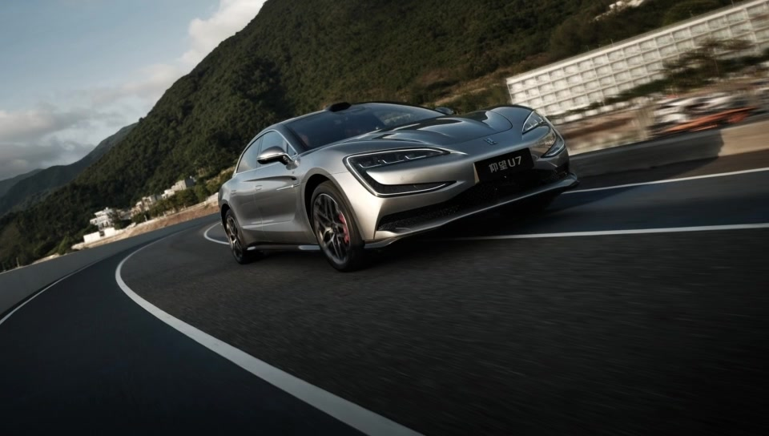

# 银色仰望 U7 · Codex macOS 启动动画

一段约 6.3 秒的银色仰望 U7 山路进场动画，以及在 macOS 上播放它并交接到真实 Codex 窗口的独立启动器。



## 下载和使用

下载仓库中的 [`U7-Codex-Boot-Mac.zip`](U7-Codex-Boot-Mac.zip)，解压后双击 `U7 Codex Boot.app`。启动器会打开已安装的 Codex，播放动画，在尾帧等待窗口就绪，随后淡出交接。按 `Esc` 可以跳过。

应用包在 Apple Silicon Mac 上构建并实测。它不会更改 Codex、Dock 图标或系统启动入口；要播放动画，需要通过此 app 打开 Codex。首次打开本地签名的 app 如遇 macOS 安全提示，可在 Finder 中右键选择“打开”。

## 内容

- [`source/u7-entrance-final.mp4`](source/u7-entrance-final.mp4)：最终启动动画，960×544、24 fps，含生成的环境声。
- [`source/u7-entrance-test.mp4`](source/u7-entrance-test.mp4)：MiniMax-H3 生成的原始试片。
- [`source/first-empty-road.png`](source/first-empty-road.png) 与 [`source/last-silver-u7.jpg`](source/last-silver-u7.jpg)：首尾帧。
- [`source/make_pipeline.py`](source/make_pipeline.py)、[`source/first-last-template.vpipeline`](source/first-last-template.vpipeline) 与 [`source/prompt.txt`](source/prompt.txt)：Vpipe 工作流生成脚本、模板和视频提示词。
- [`source/U7Boot.swift`](source/U7Boot.swift) 与 [`source/build.sh`](source/build.sh)：macOS 启动器源码及构建脚本。

本机使用 Vpipe Manager 的 MiniMax-H3-FL2VA-8bit 首尾帧工作流。无车首帧由图像生成工具根据现有 U7 照片编辑得到，编辑提示词在 [`source/image-edit-prompt.txt`](source/image-edit-prompt.txt)。生成视频中的车牌和少量细节会变化，因此最终停留画面短暂淡入原始 U7 照片。

重新构建启动器需要 macOS、Xcode 命令行工具：

```sh
cd source
zsh build.sh dist
```

视频与图片的使用说明见 [MEDIA_NOTICE.md](MEDIA_NOTICE.md)。
